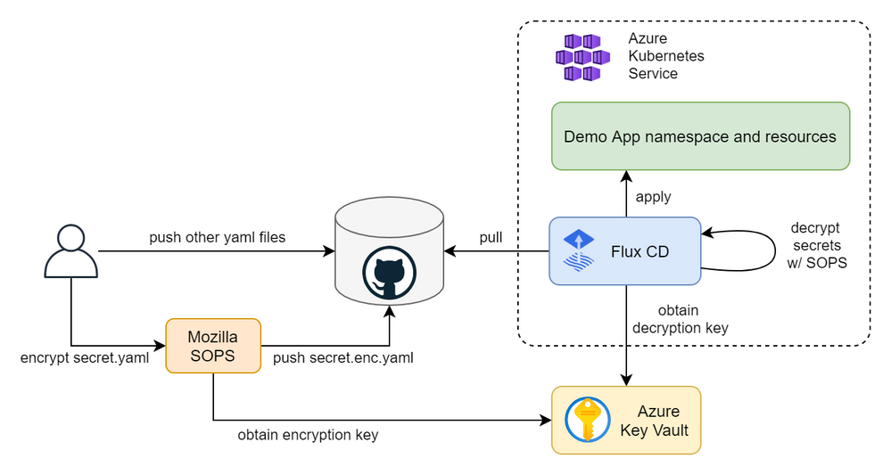

### Install Flux

```
wget https://toolkit.fluxcd.io/install.sh -O install.sh
sudo bash ./install.sh
```

### Bootstrap Flux

```
export GITHUB_TOKEN=<your-token>
export GITHUB_USER=<your-username>
export GITHUB_REPO=<name-of-your-repo>
export CLUSTER_NAME=GitOpsDemoCluster

flux bootstrap github --owner=$GITHUB_USER --repository=$GITHUB_REPO --branch=main \
--path=./clusters/$CLUSTER_NAME
```

### Create flux repository

```
flux create source git gitops-demo \
  --url=https://github.com/$GITHUB_USER/gitops-demo\
  --branch=master \
  --interval=30s \
  --export > ./clusters/gitops-demo.yaml
```

### Create flux application (kustomization)

```
flux create kustomization demoapp \
  --namespace=flux-system \
  --source=gitops-demo \ # git repo
  --path="./manifests" \ # path to yaml manifest
  --prune=true \
  --interval=5m \
  --export > ./clusters/$CLUSTER_NAME/demoapp-kustomization.yaml
```

### Useful command

* flux get kustomization --watch

* flux diff kustomization flux-system --path clusters/GitOpsDemoCluster/

* flux reconcile kustomization flux-system with-source

* kubectl get kustomization -A

### Diagram



## Reference:
https://techcommunity.microsoft.com/t5/azure-global/gitops-and-secret-management-with-aks-flux-cd-sops-and-azure-key/ba-p/2280068